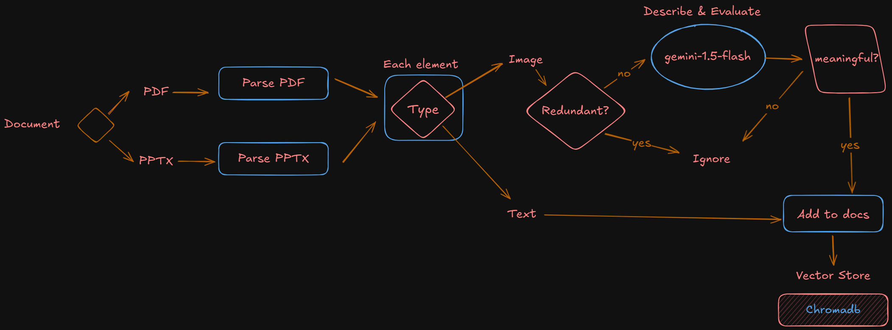
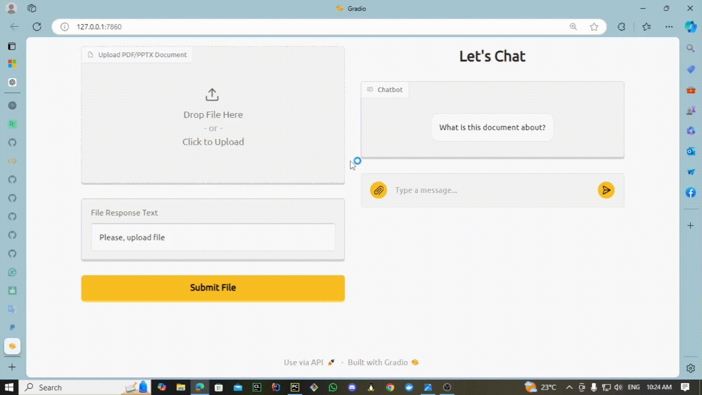
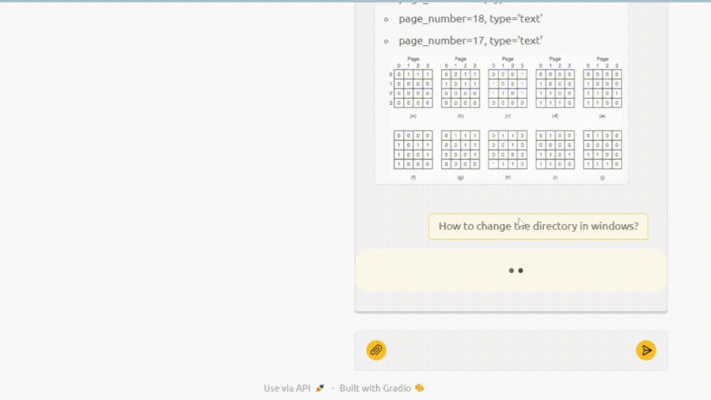

# Multimodal Agentic Corrective RAG Chatbot

**Multimodal Agentic [CRAG](https://langchain-ai.github.io/langgraph/tutorials/rag/langgraph_crag) Chatbot** is a comprehensive document question answering tool that leverages the power of large language models (LLMs), vector databases, and advanced RAG techniques to provide insightful answers to your questions. Whether you're a researcher, a student, or simply looking for a smart way to extract information from documents, tis app has got you covered.  
> **Corrective-RAG (CRAG)** is a strategy for RAG that incorporates self-reflection / self-grading on retrieved documents.
---

# Project Structure (main components):

- **agent_graph:** Contains the core logic for the CRAG agent graph.  

- **agents:** Defines the functions of each agent.  

- **database:** Manages interactions with ChromaDB for vector storage and retrieval.  

- **models:** Defines the underlying models used within each node in the graph (retriever model, grader model, etc.).  

- **parsers:** Handles document parsing for different formats (currently supports PDF and PPTX).  

- **utils:** Contains functions that are commonly used throughout the project.  

- **app:** The main class that integrates everything and launches the Gradio interface.  

---

# Technologies Used

- [**Langchain**:](https://www.langchain.com/) A framework for developing applications powered by language models.
  
- [**ChromaDB**:](https://docs.trychroma.com/) A vector database that allows for efficient data retrieval and similarity search.
  
- [**LangGraph**:](https://www.langchain.com/langgraph) A framework for building stateful, multi-actor agents with LLMs that can handle complex scenarios and collaborate with humans.
  
- [**Gradio**:](https://www.gradio.app/) A library for creating user-friendly web interfaces for machine learning models.

- [**Gemini:**](https://ai.google.dev/) An advanced AI LLM known for its multi-modal capabilities and enhanced understanding of context.

- [**Mistral:**](https://mistral.ai/) A powerful LLM designed for high-performance natural language processing tasks.

- [**Tavily:**](https://tavily.com) A search engine built for AI agents (LLMs) that delivers real-time, accurate, and factual results.

---
# Project Workflow:

- **Pereparing the vector database:**

  <p align='center'>
     
  </p>

- **Question Answering:**

  <p align='center'>
     
  </p>

---
# Installation

To set up and test the project, follow these steps:

1. **Clone the Repository**:  
   ```bash
   git clone https://github.com/yourusername/corrective-agentic-rag.git
   cd corrective-agentic-rag
   ```

2. **:** Add your API keys and tokens in the `.env.example` file and rename it as `.env`.:  
   ```bash
   GOOGLE_API_KEY = <add yours>
   MISTRAL_API_KEY = <add yours>
   TAVILY_API_KEY = <add yours>
   HF_TOKEN = <add yours>
   ```

2. **Install Dependencies:** Ensure you have `Python 3.10+` and install the required packages:  
   ```bash
   pip install -r requirements.txt
   ```

3. **Run the Application:** Start the application using:  
   ```bash
   python app.py
   ```

4. **Access the Interface:** Open your web browser and navigate to http://localhost:7860 to interact with the application.

---
# Usage and key features

### File Uploading
> You can upload either PDF or PPTX file to be proccessed.

<p align='center'>
     
</p>

### Multimodal retriever
> The bot will provide the relevant image from the document if founded.

<p align='center'>
     
</p>

### Web Search Tool
> If your question cannot be answered from the document, the bot will search the web for relevant documents and provide the resources along with the answer.

<p align='center'>
     
</p>


---
# Contributing
### Contributions are welcome! If you’d like to contribute to the project, please follow these steps: 

- Fork the repository.
  
- Create a new branch `git checkout -b feature/YourFeature`.
  
- Make your changes and commit them `git commit -m 'Add some feature'`.
  
- Push to the branch `git push origin feature/YourFeature`.

- Open a pull request.

---
# Contact
For questions or feedback, feel free to reach out:

* [Gmail](mailto:Mohammed.Khayyat02@eng-st.cu.edu.eg)
* [LinkedIn](https://www.linkedin.com/in/mohammed-elkhiat-66b36521a)


